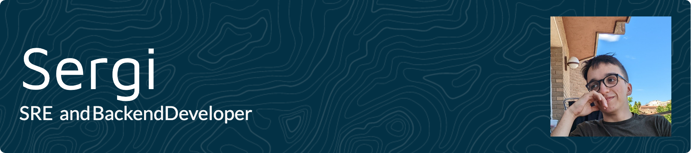

<p align="left">  </p>

I'm a 4th year Computer Science student, DevOps/SRE fan, Go and Java developer. Back in the days, I wrote a _lot_ of Minecraft Multiplayer related stuff.


### 📖 Currently learning
  - [Rust](https://www.rust-lang.org)
  - [Clickhouse](https://clickhouse.com)
  - [CockroachDB](https://www.cockroachlabs.com/)
  - [Kubernetes](https://k8s.io)

### 🔬 Research Interests:
  - Cloud Architecture
  - Networking
  - Distributed Systems

### 🌍 Projects
  - [Messaging](https://github.com/sergivb01/Messaging): Multiplatform messaging system
  - [Toastr](https://github.com/sergivb01/Messaging): Authentication plugin written for VelocityPowered.

### 📆 Activity
<!--START_SECTION:waka-->

```txt
From: 17 September 2023 - To: 24 September 2023

Total Time: 8 hrs 55 mins

YAML              2 hrs 58 mins   ⣿⣿⣿⣿⣿⣿⣦⣀⣀⣀⣀⣀⣀⣀⣀⣀⣀⣀⣀⣀⣀⣀⣀⣀⣀   26.02 %
Other             2 hrs 29 mins   ⣿⣿⣿⣿⣿⣦⣀⣀⣀⣀⣀⣀⣀⣀⣀⣀⣀⣀⣀⣀⣀⣀⣀⣀⣀   21.80 %
Java              2 hrs 26 mins   ⣿⣿⣿⣿⣿⣤⣀⣀⣀⣀⣀⣀⣀⣀⣀⣀⣀⣀⣀⣀⣀⣀⣀⣀⣀   21.37 %
Bash              1 hr 10 mins    ⣿⣿⣦⣀⣀⣀⣀⣀⣀⣀⣀⣀⣀⣀⣀⣀⣀⣀⣀⣀⣀⣀⣀⣀⣀   10.30 %
Jinja2            52 mins         ⣿⣿⣀⣀⣀⣀⣀⣀⣀⣀⣀⣀⣀⣀⣀⣀⣀⣀⣀⣀⣀⣀⣀⣀⣀   07.67 %
```

<!--END_SECTION:waka-->

### 🍕 Stack


### 📫 Contact
  - [Email](mailto:contact@sergivos.dev) (_`contact@sergivos.dev`_)
  - [Twitter](https://twitter.com/sergivb01/)
  - [Website](https://sergivos.dev)
  - [LinkedIn](https://linkedin.com/in/sergivb01/)
